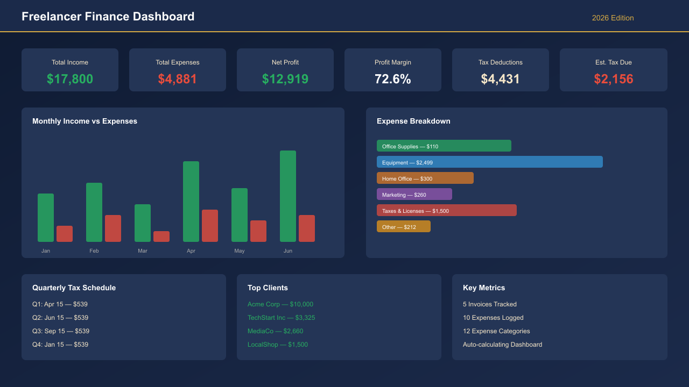

# Freelancer Finance Dashboard & Tax Estimator

> A professional Google Sheets / Excel template for freelancers to track income, expenses, and estimate quarterly taxes.

## Features

- **Income Tracking** — Log payments by client, invoice, date, and project
- **Expense Logging** — 12 pre-configured categories with tax deductibility flags (Yes/Partial/No)
- **Auto-Calculating Dashboard** — P&L, profit margins, cash flow, and charts update instantly
- **Quarterly Tax Estimation** — Estimates self-employment tax (15.3%) + federal income tax
- **Monthly Trends** — Income vs expenses with cumulative totals for the year
- **Expense Breakdown** — By category with deductible amounts
- **Top Client Analysis** — Revenue per client, invoice count, average per invoice
- **Tax Payment Schedule** — 2026 quarterly deadlines with payment amounts

## Screenshots

| Dashboard | Income Log | Expenses |
|-----------|-----------|----------|
| KPI cards, monthly trends, expense breakdown | Client payments, platform fees, net received | Vendor, category, tax deductibility |

## How to Use

### Google Sheets (Recommended)
1. Download the `.xlsx` file
2. Upload to Google Drive → Double-click to open
3. Replace sample data with your own records
4. Everything calculates automatically

### Microsoft Excel
1. Open `Freelancer_Finance_Dashboard.xlsx`
2. Replace sample data with your own records
3. All formulas work natively in Excel

## What's Included

| Sheet | Description |
|-------|-------------|
| Setup | Configuration, instructions, expense category reference |
| Income | 50-row income log with client, invoice, amount tracking |
| Expenses | 90-row expense log with 12 categories and tax deductibility |
| Dashboard | Auto-calculating P&L, tax estimates, monthly trends |

## Compatibility

- ✅ Microsoft Excel (2016+)
- ✅ Google Sheets
- ✅ Apple Numbers (import)

## Pricing

- **Launch Price:** $29
- **Regular Price:** $39
- Compatible with all major spreadsheet platforms

## Support

Contact the seller via Gumroad for questions or customizations.

---

**Built with ❤️ for freelancers who want to stay on top of their finances.**
